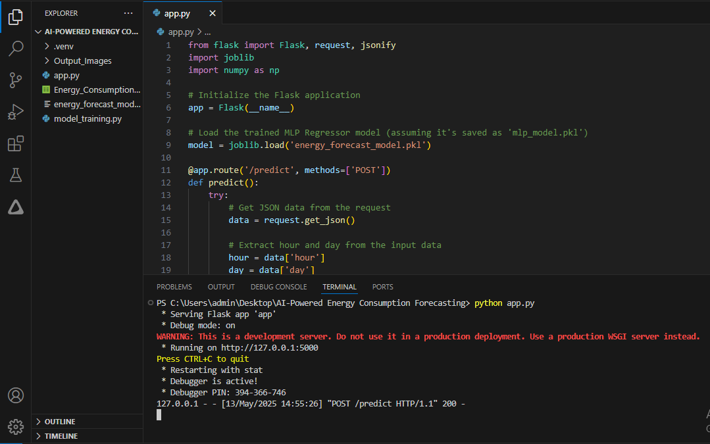
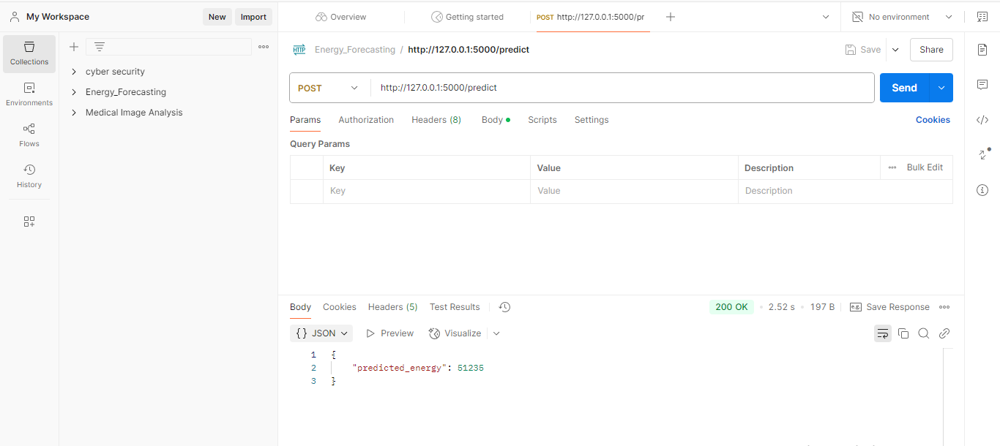

# 🚀 AI-Powered Energy Consumption Forecasting

A machine learning solution to predict future energy consumption (in megawatts) based on time-based inputs like hour, day, and weekday. This system is built using Python, trained with real-world energy usage data, and deployed via a Flask API for easy integration.

## 🎯 Project Objective -

To develop an efficient and accurate energy forecasting system using machine learning. By leveraging time-based data, this project aims to provide valuable insights that help:

- Optimize power generation

- Reduce energy waste

- Enable better grid management

This is especially impactful in the context of smart grids and renewable energy integration.

## 🧠 Why This Project Matters -
Accurate energy forecasting is essential for:

- Balancing electricity supply and demand

- Reducing environmental impact

- Improving the efficiency of energy systems in smart cities and sustainable infrastructures
 
## 🔧 Tech Stack

- Python 🐍: Core language used for data processing, model training, and API development.

- Scikit-learn: Used for building the MLP Regressor model to predict energy consumption.

- Pandas & NumPy: For efficient data preprocessing and numerical computations.

- Flask: Lightweight web framework to deploy the trained model as an API.

- Joblib: For saving and loading the trained machine learning model.

- Postman: Tool for testing and validating API endpoints.

- Visual Studio Code (VS Code): Code editor used for writing and managing the project.

## 🧪 How to Use -
### 1. ⚙️ Train the Model
- Run the following script to preprocess the data and train the model:
```
python model_training.py
```
### 2. 🚀 Start the Flask API
- Start the Flask API to serve the trained model:
```
python app.py
```
### 3. 📬 Send Input via Postman
- Send a POST request with this JSON to predict energy consumption:
```
jason
{
  "hour": 14,
  "day": 2
}
```
### ✅ Output
- The API will respond with a predicted energy value:
```
jason
{
  "predicted_energy": 51235
}
```

## 📸 Preview -
### Flask Server Running  
  

### Testing with Postman  
  

## 💡 Key Learning Outcomes -
- Built & trained a real-world regression model from scratch.
  
- Developed a deployable API using Flask.

- Understood how time-based features influence energy consumption.

- Practiced full ML pipeline: data → model → deployment → test.
  
## 📌 License -
This project is for educational and portfolio purposes only. 

📎 Please do not reuse or distribute without permission.

© Rahul Bhoyar, All Rights Reserved.
